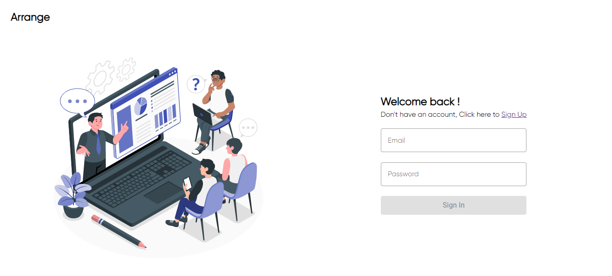
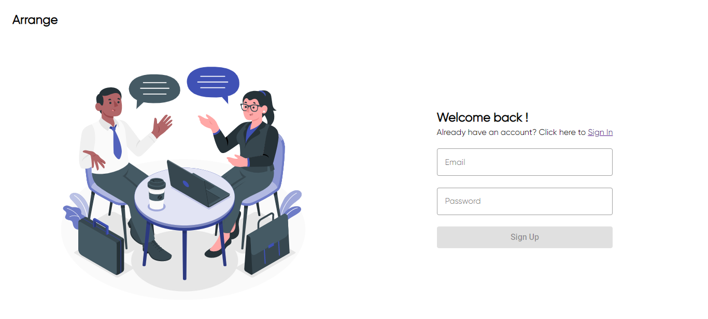
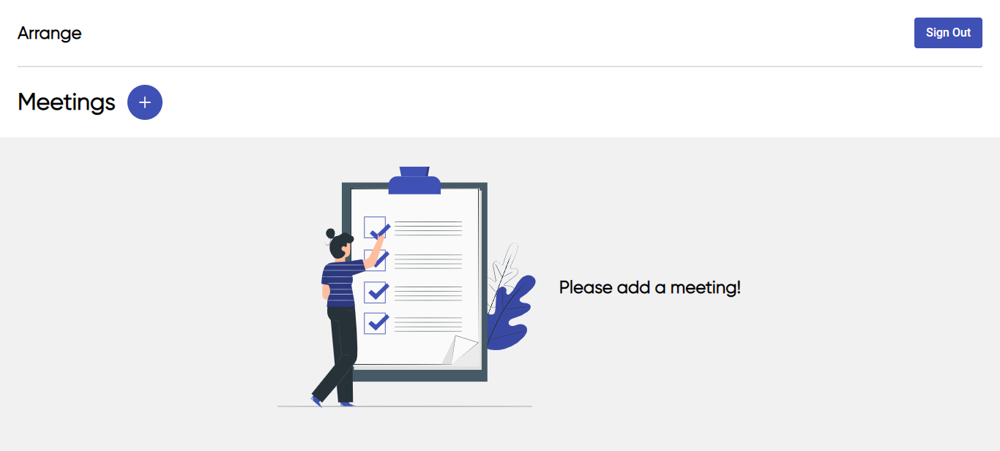
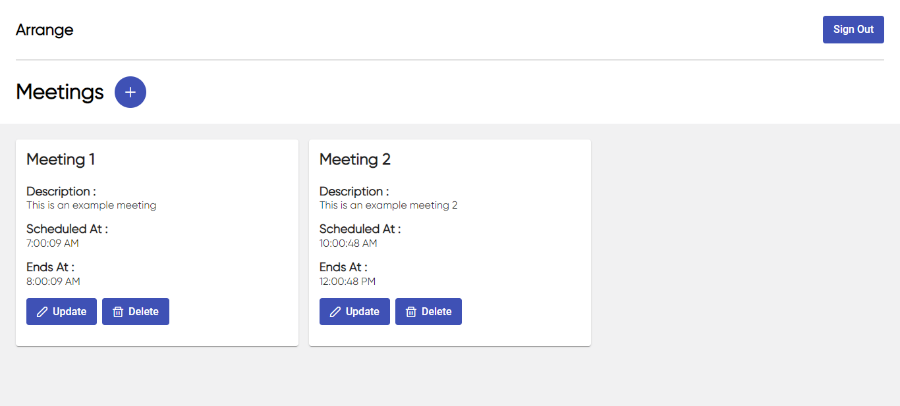

# Calender App

A Simple Calender app which has features such as -

- SignIn/SignUp Page
- Add Meetings
- View Meetings
- Delete Meetings
- Update Meetings

It is built with React (PrimeReact Framework) and Firebase (Authentication).

## Demo






## How to run this app on your local machine ?

After cloning this repository run this command. This will install all the dependencies.

```
$ npm install
```

To launch it on localhost, run

```
$ npm start
```
